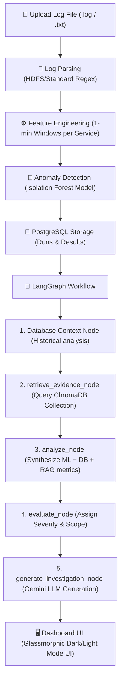

# SentinelAI 🛡️

[](https://react.dev/)
[](https://vite.dev/)
[](https://fastapi.tiangolo.com/)
[](https://www.postgresql.org/)
[](https://www.trychroma.com/)
[](https://langchain-ai.github.io/langgraph/)
[](https://ai.google.dev/)

SentinelAI is an advanced, AI-powered incident investigation and log anomaly detection system. It ingests raw server logs (e.g. HDFS or standard server output), processes them through a custom machine learning pipeline to detect anomalies, retrieves context-specific documentation from a RAG knowledge base, and orchestrates a detailed incident report using a LangGraph workflow powered by Google's Gemini LLM.

---

## 🛠️ Tech Stack & Architecture

- **Frontend:** React 19, Vite 8, TailwindCSS v4, Lucide Icons, react-markdown, jsPDF, html2canvas
- **Backend:** FastAPI, psycopg3, PostgreSQL, scikit-learn (Isolation Forest), Joblib
- **RAG & GenAI:** ChromaDB, SentenceTransformers (`all-MiniLM-L6-v2`), LangGraph, google-genai (Gemini 2.5)

### System Dataflow Pipeline



---

## 🌟 Key Features

1. **Anomaly Detection Pipeline:** Automated HDFS parser aggregates log streams into 1-minute time windows, calculating 12 telemetry features. Scikit-learn's Isolation Forest classifies anomalous server behaviour.
2. **LangGraph Investigation Loop:** Orchestrates an incident investigation graph ensuring final reports are strictly grounded in PostgreSQL run histories and vector store runbooks.
3. **Advanced RAG Engine:** Indexes and retrieves diagnostic evidence chunks from Markdown guides using dense vector similarity.
4. **Premium Dashboard UI:** Modern dark-theme glassmorphism portal featuring local Drag-and-Drop file ingestion, light/dark mode switcher, custom charts, and a floating toast notification manager.
5. **Interactive Report Export:** Export AI-generated reports to Markdown or clean A4-formatted PDF.
6. **PostgreSQL History Browser:** Search, filter, and inspect past analysis runs and window anomaly details stored in PostgreSQL.
7. **Mock Development Mode:** Toggle switch to mock the Gemini LLM endpoint and test frontend components locally without hitting API rate quotas.

---

## ⚙️ Project Setup

### Option 1: Docker (Recommended)

Run the entire stack (PostgreSQL database, FastAPI backend, React frontend) with a single command:

1. Copy `.env.example` (or create `.env`) in the root directory:
   ```env
   GEMINI_API_KEY=your_gemini_api_key
   GEMINI_MODEL=gemini-3.5-flash

   DB_HOST=postgres
   DB_PORT=5432
   DB_NAME=sentinelai_db
   DB_USER=postgres
   DB_PASSWORD=your_secure_password
   ```

2. Start the multi-container stack:
   ```bash
   docker compose up --build
   ```

3. Access the services:
   - Frontend Dashboard: `http://localhost`
   - Backend API Docs: `http://localhost:8001/docs`

---

### Option 2: Local Manual Setup

#### Prerequisites
- Python 3.12+
- Node.js 20+
- PostgreSQL server active on localhost

#### 1. Database Setup
Create a PostgreSQL database named `sentinelai_db` and initialize tables:
```bash
python create_tables.py
```

#### 2. Vector Store Setup
Index the knowledge base markdown files into the local ChromaDB instance:
```bash
python index_knowledge_base.py
```

#### 3. Backend Setup
Activate your python environment and run uvicorn:
```bash
# In root directory
pip install -r backend/requirements.txt
uvicorn backend.app.main:app --reload --host 127.0.0.1 --port 8001
```

#### 4. Frontend Setup
Install npm packages and run Vite:
```bash
cd frontend
npm install
npm run dev
```
Open `http://localhost:5175` in your browser.
